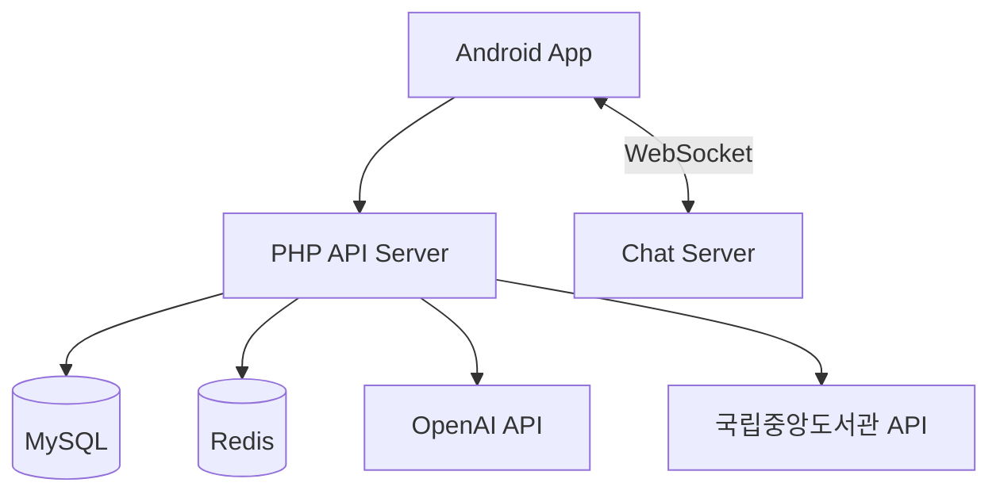
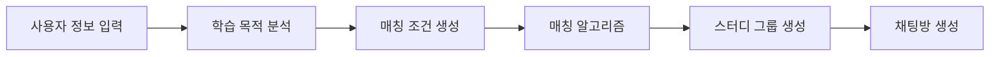
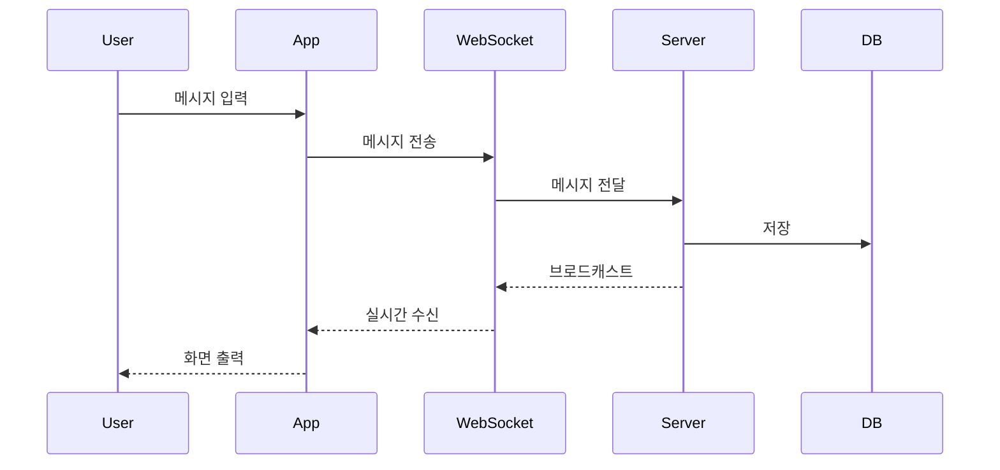
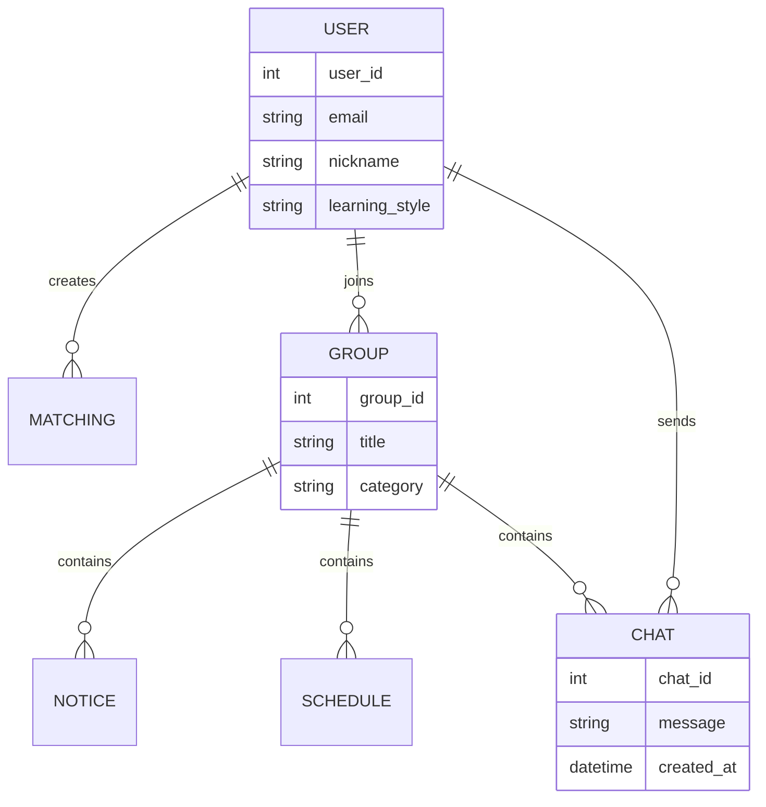

# 📚 STUDIFY

> 학습 목적·성향 기반 스터디 매칭 플랫폼


---

# 📖 프로젝트 소개

STUDIFY는 대학생들을 위한 **학습 목적·성향 기반 스터디 매칭 플랫폼**입니다.

기존 스터디 모집 방식은 사용자가 직접 게시글을 작성하고 스터디원을 구해야 하는 불편함이 있습니다.

STUDIFY는 사용자의 학습 목표, 선호 시간, 학습 스타일 등을 분석하여 적합한 스터디원을 추천하며, 스터디 운영에 필요한 기능을 하나의 플랫폼에서 제공합니다.

---

# ✨ 주요 기능

## 🔐 회원 관리

- 학교 이메일 인증
- 회원가입 및 로그인
- JWT 기반 인증

## 🎯 스터디 매칭

- 번개 매칭
- 그룹 매칭
- 멘토 · 멘티 매칭
- 직접 방 생성

## 👥 그룹 관리

- 그룹 생성
- 일정 관리
- 공지사항 관리
- 멤버 관리

## 📈 학습 지원

- 진도 체크
- 출석 관리
- 학습 가이드라인 제공
- 도서 추천

## 💬 실시간 채팅

- WebSocket 기반 채팅
- 그룹별 채팅방

## 🎁 리워드 시스템

- 포인트 적립
- 상점 기능
- 리워드 교환

---

# 🏗️ 시스템 아키텍처



---

# 🔄 스터디 매칭 흐름



---

# 💬 채팅 시스템 흐름



---

# 🗄️ ERD



---

# 🛠 Tech Stack

## Frontend

- Kotlin
- Jetpack Compose
- Navigation Compose
- Hilt
- Room Database

## Backend

- PHP
- Node.js
- WebSocket

## Database

- MySQL
- Redis

## External API

- OpenAI API
- 국립중앙도서관 Open API

## Tools

- Android Studio
- VS Code
- GitHub
- FileZilla
- PuTTY

---

# 📂 프로젝트 구조

```text
studify
├── app
│   ├── ui
│   ├── screen
│   ├── navigation
│   ├── viewmodel
│   ├── repository
│   ├── data
│   └── di
│
├── server
│   ├── api
│   ├── websocket
│   └── php
│
├── database
│   ├── mysql
│   └── redis
│
└── docs
```

---

# 👨‍💻 팀원

| 이름 | 역할 |
|--------|--------|
| 이종원 | 채팅, WebSocket, Redis, 로그인, 매칭, RoomDB |
| 강명묵 | 학습 가이드라인, 마이페이지, 멘토·멘티 |
| 박종연 | 회원가입, 상점, 도서 추천 |
| 유소이 | 그룹 관리, 일정, 공지사항, UI 디자인 |

---

# 🚀 향후 개선 계획

- 추천 알고리즘 고도화
- Redis 캐싱 최적화
- iOS 버전 개발
- 웹 버전 개발
- LMS 연동
- 학사정보 시스템 연동

---

# 🎥 시연 영상

https://youtu.be/ovoFQB0CHD8

---

# 📄 License

본 프로젝트는 학습 목적으로 개발된 프로젝트입니다.
